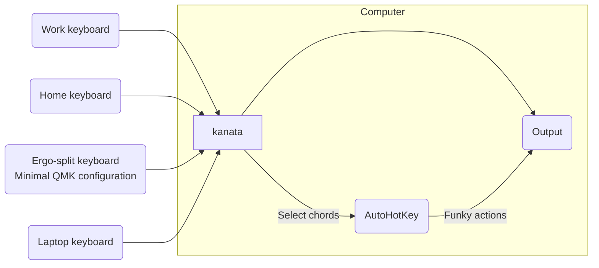

# George's kanata layout

I find myself typing on different keyboards at home, at work, and on my laptop. The approach of using QMK to configure keyboards individually doesn't really make sense if I want to have a similar approach when writing on the laptop.

Therefore, instead of using QMK to configure multiple keyboards I use [kanata](https://github.com/jtroo/kanata) to remap all inputs, which has similar functionality to QMK (support for layers, tap dance etc.), but it works on the computer itself.

## Design philosophy

The layout must work for both my laptop, various sized mechanical keebs, and a split ergo. Although the split-ergo has a very different layout to the others, a key constraint (heh) is that the layout should be as similar as possible to what I'd use on a keyboard with a regular key arrangement. The solution is to pack as much as into only the alpha keys.

My solution is currently to use each of the home-row keys as a layer-while-held modifier (i.e. while one key is held down a new layer is active).

