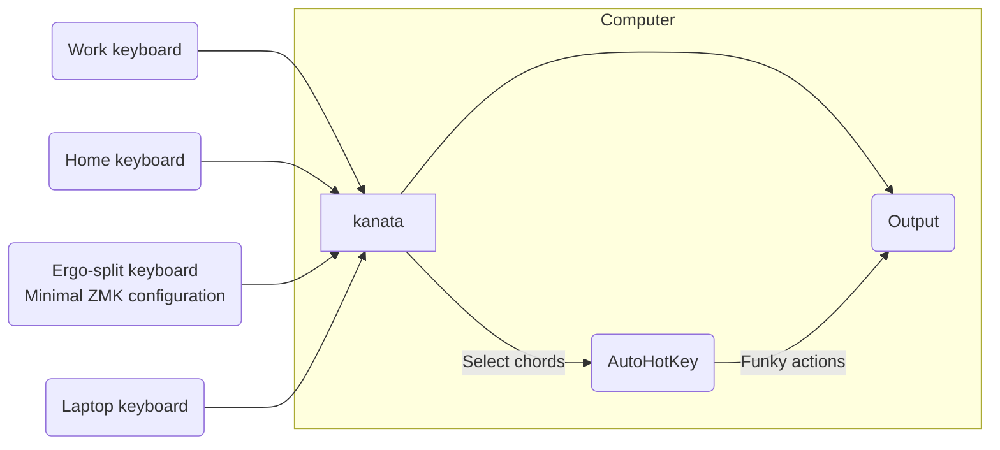

# George's kanata layout

I find myself typing on different keyboards at home, at work, and on my laptop. The approach of using QMK to configure keyboards individually doesn't really make sense if I want to have a similar layout when writing on the laptop or on different keyboards. Similarly, well developed layout approaches like [Miryoku](https://github.com/manna-harbour/miryoku/) are highly reliant on thumb clusters and so aren't applicable to normal keyboards (kinda[^1]). I want a layout that is agnostic to the physical layout of the keyboard. I also type roll too much to make use of homerow mods.

[^1]: I discovered that Miryoku features the [KMonad layout](https://github.com/manna-harbour/miryoku_kmonad) which aims to support full Miryoku on standard keyboards. The home row is moved up one layer, which is pretty cool. I've put a pin in that for now, since I've been enjoying building my own layout.

So instead of using ZMK to configure multiple keyboards I use [kanata](https://github.com/jtroo/kanata), a computer program which has similar functionality to QMK/ZMK (support for layers, tap dance etc.), to remap inputs on the computer itself. This also means that if I want to make changes to the keymap that they're quite easy to do from my device, whereas ZMK requires the use of GitHub Actions to build the firmware.

## Design philosophy

The layout must work for both my laptop, various sized mechanical keebs, and a split ergo (Corne). Although the split-ergo has a very different layout to the others, a key constraint (heh) is that the layout should be the same as what I'd use on a regular keyboard. In other words, a 31 layout (10x3 + spacebar).

My solution is currently to use each of the home-row keys as a layer-while-held modifier (i.e. while one key is held down a new layer is active). 

1. Base layer: unmodified layout from default QWERTY with alpha key hold modifiers
2. Rapid access: arrows, backspace, thousands of usages per day
3. MEH: editor navigation
4. Symbol
5. Number

Each layer should also be able to do double duty as `layer-while-held`, and using some kind of `layer-switch` mechanism.

### Constraints

- AutoHotKey and kanata behave weirdly with F13+
- JetBrains IDEs can't handle F13+

My right hand prefers inward rolls, while my left hand doesn't seem to mind at all.

## Layers

### Rapid access/text manipulations

This layer is the most important layer. Other layers are grouped by function, like a numbers layer or symbols layer, while this layer is simply a question of high-usage. On a normal keyboard there's a set of fast cursor manipulations that can be done if your hands are on the arrow keys and the modifiers. With only <kbd>Ctrl</kbd>, <kbd>Shift</kbd>, <kbd>Alt</kbd>, arrow keys, <kbd>End</kbd>, <kbd>Delete</kbd>, and <kbd>Backspace</kbd> there are a lot of ways you can combo those together in many different programs to manipulate text. The rapid access layer is built for easy access to these items.

The left index finger activates this layer, with the other fingers of the left hand accessing the modifier keys. The right hand has movement, like Up Arrow to Page Down, and key manipulations, like Backspace and Delete.

Since I'm not a vim user the IJKL as the arrow keys works for me.

For me, this layer came about very organically. It started out with only the arrows and <kbd>Backspace</kbd>, but over time I found myself adding to it and shuffling things around for feelings that make more sense. In my opinion other layers don't have to be as optimised if they aren't accessed as much.

### MEH layer/editor navigation/shortcut layer

The rapid access layer is built to support operations that I do a thousand times a day, while the MEH (<kbd>Ctrl</kbd>+<kbd>Shift</kbd>+<kbd>Alt</kbd>) modifier layer can support editor-specific shortcuts and operations that are used a hundred times a day.

The following is a list of shortcuts that I use regularly across multiple editors, and so they should all be configured to use the same shortcuts (and therefore the same kanata MEH+key).

The three systems I do most of my writing in are Notepad++, VS Code, and PyCharm.

| Action                 | Key (with <kbd>meh</kbd>) | Notepad++ | VS Code                               | PyCharm                    |
| ---------------------- |:-------------------------:| --------- | ------------------------------------- | -------------------------- |
| Run cell               | <kbd>f</kbd>              |           | macros.RunCellinTerminal[^2]          | Run Cell[^3]               |
| Run selection          | <kbd>d</kbd>              |           | Run Selection/Line in Python Terminal |                            |
| Focus editor           | <kbd>a</kbd>              |           | Focus Active Editor Group             | Focus editor               |
| Focus terminal         | <kbd>s</kbd>              |           | Focus on Terminal View                | Python console             |
| Command Palette        | <kbd>k</kbd>              |           | Command Palette                       | Find Action                |
| Jump                   | <kbd>g</kbd>              |           | Activate Find-Jump                    | Acejump Activate           |
| Sidebar Toggle         | <kbd>b</kbd>              |           | Toggle Primary Side Bar Visibility    |                            |
| File explore           | <kbd>q</kbd>              |           | Focus on Folders View                 | Tool Windows > Project     |
| File switcher          | <kbd>w</kbd>              |           | Go to File                            | View Recent Files          |
| Recent locations       | <kbd>e</kbd>              |           |                                       | Recent Locations           |
| Symbol jumper          | <kbd>r</kbd>              |           | Go to Symbol in Workspace             | Go to Symbol               |
| Definition             | <kbd>t</kbd>              |           | Go to Definition                      | Go to Declaration          |
| Peek Definition        | <kbd>y</kbd>              |           | Peek Definition                       | Quick Definition           |
| Breadcrumbs            | <kbd>i</kbd>              |           | Focus Breadcrumbs                     | Jump to Navigation Bar     |
| File Structure         | <kbd>u</kbd>              |           | Go to Symbol in Editor                | File Structure             |
| Run cell and move next | <kbd>v</kbd>              |           |                                       | Run Cell and Move Next[^2] |
| Set bookmark           |                           |           |                                       |                            |
| Next bookmark          |                           |           |                                       |                            |
| Previous bookmark      |                           |           |                                       |                            |
| Quick documentation    | <kbd>h</kbd>              |           | Show hover                            | Quick Documentation        |
|                        |                           |           |                                       |                            |

[^2]: Macros plugin from ctf0
[^3]: PyCharm Cell mode plugin

### Symbol and Number Layers

I don't think there's much to say here, other than I take the normal keypad approach for numbers and the symbols are just squished onto a 4x3 grid.

### App Switching Layer

After watching Ben Vallack's App Switching video, I figured I would find something like that very useful.

A simple AutoHotKey script is used to control focus on windows based on the .exe they are controlled by. Unfortunately AutoHotKey and kanata don't handle F13+ keys at all.

## Ergo keyboard mounting

My ergo split keyboard is the Corne, with nice!nano controllers for bluetooth.
One key addition is magsafe compatible metal circles onto the underside of the case (seen [here](https://github.com/SethMilliken/swept-corne-zmk/tree/magsafe-mount) and [here](https://evantravers.com/articles/2023/04/06/magsafe-tenting-and-wearable-keyboards/)). Magnets can now be used to mount the system, which could support many different approaches.

I purchased cheapo metal circles, the adhesive for which was not strong enough so I used superglue to secure them after removing the adhesive with acetone. The MagSafe mounts featured 1/4" threads, so I could screw them onto Small Rig articulating arms for [tenting flexibility](https://www.reddit.com/r/ErgoMechKeyboards/comments/11o8rna/my_fav_tenting_solution/).